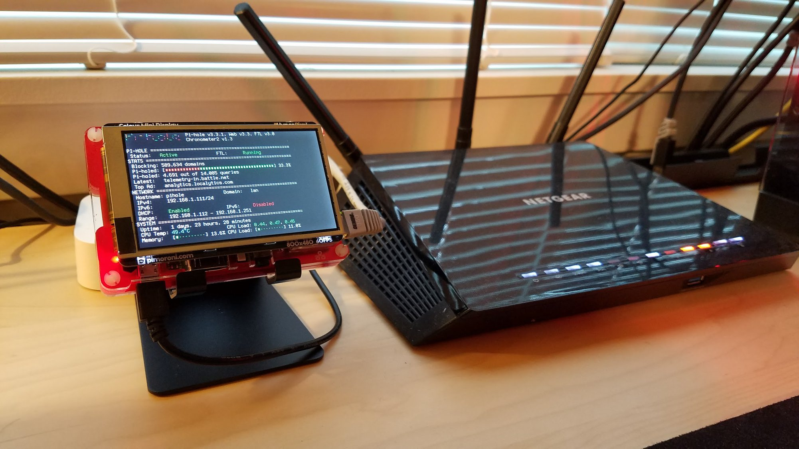

# Beginner's guide to building a PiHole

***Block ads and trackers on every device and regain control of your home network!***

This guide is in the works, but should currently contain all the information you need to get up and running. This was written in 2018 but should still be applicable. If you encounter any issues, please add them in the issues section and I will update the guide! 



## A Brief FAQ

### How difficult is this? Do I need to be a computer/network/linux/hardware expert?

Building a PiHole is super-easy, relatively cheap, and requires no special tools or hardware skills! Some basic command line experience could be helpful, but even if you've never touched a Unix machine before you should be able to get yourself up and running without any issues. The PiHole community is huge, with tens of thousands of people on the [SubReddit](https://www.reddit.com/r/pihole/) and [Discourse](https://discourse.pi-hole.net/), and there are loads of up-to-date guides and instructions online in case you get stuck. This guide will cover all the basics as well as some of the bells and whistles.

### How does a DNS sinkhole work, anyway?

To understand how the PiHole works, let's dive into what DNS (Domain Name Service) actually means. You're familiar with accessing websites websites by their URL (universal resource locator, e.g. www.google.com) but, under the hood, devices on a network (like the internet) identify themselves using a numeric IP address (e.g. 123.123.12.3) which is used to send and receive traffic to/from that device. DNS is a system that translates URLs into IP addresses so that you don't have to remember the numeric IP for every person/website you want to connect to - see this [comic](https://howdns.works/) or [wikipedia article](https://en.wikipedia.org/wiki/Domain_Name_System) for more details. 

Usually, when your computer wants to contact a website (or server, or ad, or tracker), it sends a DNS request to your internet service provider to ask it where to find the content it's looking for. Once you set up a PiHole, it will act as a middleman between you and that translator, forwarding along good requests and blocking any requests that you've blacklisted (ads, etc.).

## The Quick Summary

I've tried to include a lot of information in the guide below, which might make it seem like a long process, but if you're interested in the tl;dr, it boils down to just a few easy steps:

1. Get a Raspberry Pi and some cables to plug it in
2. Install Raspbian/NOOBS (Raspberry Pi Linux) on a microSD card and log into the pi
3. Configure a couple settings on your router to assign the Pi a static IP
4. Install `PiHole` on the raspberry pi (one command and a quick setup wizard)
5. Configure your router to use the PiHole for DNS queries (and optionally DHCP)
6. Add the appropriate blacklists/whitelists to the PiHole to block ads

## The Parts

Below I've outlined the parts you'll need to set up your PiHole. I've also put in an 'optional' section in case you want to go a bit further and add a case, screen, etc. 

Everything I used can be found on Amazon, Pimoroni (a website/community dedicated to Raspberry Pi), or Adafruit (a wonderful maker electronics website) but you can also get most of these components for [an order of magnitude] cheaper shipped from overseas if you're willing to wait a few weeks for shipping. When I mention overseas suppliers, I'm talking about sites such as [Monoprice](https://www.monoprice.com/), [DealExtreme](http://www.dx.com), [Alibaba](https://www.alibaba.com/), and [DHGate](https://www.dhgate.com)

### Bare minimum

- Raspberry Pi ($10-35)
- Power supply ($free-$7.50)
- Ethernet cable ($free-$3)
- MicroSD card ($8-15)
- USB mouse + keyboard and HDMI monitor/TV - you probably have these

**Raspberry Pi**

- There are a few models of Raspberry Pi out there, almost all of which will work for this project. The latest model is the Model 3 B+, which has ethernet, USB, wifi, etc. The Model 2 is similar. You can also pick up a Pi Zero, which is tiny and only costs $5, but will need extra adapters to get it hooked up to a network.
- I used the newest model (Raspberry Pi 3 B+)

**Power supply cable**

- Many phone chargers or microUSB cables will work in a pinch, but most don't put out enough juice for the Pi to operate stably long-term. You'll want to make sure you have a power supply that can provide sufficient voltage/current to the Pi or you could end up putting a lot of stress on the components. 
- I used [this](https://www.adafruit.com/product/1995) power supply, you can probably find it cheaper at overseas suppliers

**Ethernet cable**

- Though many Raspberry Pis have wireless chips, you'll want to hardwire your pi-hole to your router to make sure it has a fast and stable connection.
- I used a spare CAT5e ethernet cable I had laying around.

**MicroSD card**

- The raspberry pi has no storage, so you'll need a microSD card that's at least 4GB to hold the operating system and data. Though you can potentially get by with 4GB, I recommend 8GB-16GB so that you have space to store logs and data.
- You'll also need something that can read/write MicroSD cards. If you have a current/old Android phone, it can most likely read/write SD cards (I used my old Motorola droid). Most laptops have an SD card slot.  If not, readers are available online for a few dollars e.g. this one TODO or this one TODO.
- If you don't want to go through the trouble of creating the SD card, cards are available (e.g. TODO TODO TODO) which are pre-loaded with the raspberry pi operating system for about the same price as a card itself.

**USB mouse/keyboard and monitor**

- For the initial setup of your pi, you'll want access to a USB mouse + keyboard and a computer monitor or TV that supports HDMI. Once the Pi is set up, you won't need these anymore - you can use the web interface or ssh from another computer/phone/tablet to access and manage settings etc.

### Optional flair

**Case**

- Adding a case makes your Raspberry pi look a lot nicer and protects it from the elements. There are loads of cheap cases ($5-20) available online at Amazon, or even cheaper from overseas suppliers if you're willing to wait for shipping. 
- Make sure you pick a case that is compatible with the specific raspberry pi model you chose (e.g. most model A cases won't fit a B+). 
- If you're planning on adding a screen, make sure your case is compatible with your screen - I used a [Pibow Coupe](https://shop.pimoroni.com/products/pibow-coupe-for-raspberry-pi-3-b-plus) case which has a low profile and doesn't get in the way of any of the pins. 

**Screen**

- If you plan to keep your Pi-hole somewhere you can see it, a screen can give you at-a-glance blocking statistics, and it also looks friggin cool. There are tons of screen options for the Pi which will work with Pi-hole, from 2-line LCD screens to full 800x480 touchscreen displays. Prices vary from $3-$60 depending on the screen.

**Stand**

- If you're keeping your pi on a desk or table and plan to install a screen, it can be nice to have a stand so you can glance at it easily (most screens don't have the best viewing angle). A simple phone stand can be had for cents online (things like [this](https://www.amazon.com/gp/product/B01HPI5AM2/) should work, and can be had for pennies on the dollar if you're willing to wait for shipping from China e.g. [Monoprice](https://www.monoprice.com/), [DealExtreme](http://www.dx.com), [Alibaba](https://www.alibaba.com/), [DHGate](https://www.dhgate.com))

## 1) Getting your Pi up and running

### A) Formatting the microSD card

Before we set up the pi-hole software, let's get the raspberry pi up and running. **If you bought an SD card with Raspbian/NOOBS preloaded on it, skip to substep (B)**

1. First, you'll want to download either NOOBS or Raspbian .img file from the [Raspberry Pi website](https://www.raspberrypi.org/downloads/). 
   - I used the Raspbian file. 

2. You'll also want to install software that can write an image to a microSD card. I recommend [Etcher](https://etcher.io/) since it's super easy to use and works on both Mac and PC.
3. Plug your SD card into your adapter or phone and connect it to your computer.
   - If you're using an Android phone, drag down the notification bar, click on the **USB Connected** notification,  and enable **USB [mass] storage mode** and your SD card should appear.
4. Use Etcher or another program to write the .img file to your SD card.

You now have a microSD card ready to go!

### B) Logging into your Raspberry Pi

Insert your microSD card into the slot on the bottom of your Pi. Using the HDMI and USB ports on the pi, connect your monitor, mouse, and keyboard. Then, connect the power cable, and the Pi will turn on. It should take you straight to the desktop after a bit of logging in (default user=pi, password=raspberry). The main menu for settings etc. can be found in the top left. Network settings can be found in the top right. You can do some of the setup on wifi, but it's easier if you already have it plugged into your router via ethernet. 

### C) Configuring your Raspberry Pi

All Raspberry Pis come with a default username (pi) and password (raspberry). You'll want to change the password. You can do this by either opening up a **Terminal** window and typing `sudo passwd` then hitting enter, or by going to **settings -> raspberry pi settings** and changing it there. 

Depending on your Pi, you might need to change the keyboard layout under **Keyboard + Mouse Settings** to **English (US)**, otherwise the symbols will be weird.

If you want to be able to control your pi without having a keyboard/monitor connected to it once you've set it up, you'll also need to check the radio button to `enable SSH` in the 4th tab of the **raspberry pi settings** menu.

Finally, before you continue, find the MAC address (a unique hardware identifier for your raspberry pi) of your Pi. To do this, start a **Terminal** window and type `ifconfig`. Assuming you plan to connect your raspberry pi via ethernet - under `eth0` you should see a line that resembles `ether a1:b2:c3:d4:e5:c6` . The stuff after `ether` is the MAC address of the ethernet port - **write that down for later**

## 2) Configuring your router

#### Setting up a Static IP

For the pi-hole to work properly, it will need a static (unchanging) IP address so that your router and devices know where to find it. If you have never logged into your router, you will need to do so to change these settings. Most routers are accessible by typing either **192.168.1.1** or **192.168.0.1** into your browser's address bar. If you've never logged into your router, you may need to look up the default password, which these days is often attached to your router on a sticker somewhere. 

The next steps will vary based on their manufacturer, but what you want to find is something labeled along the lines of either **static IP** or **reserved IP**. This will usually be nestled in something along the lines of Advanced Settings, Setup, LAN setup, or DHCP setup. 

- A brief aside: **DHCP** is a system whereby a server on your network dynamically assigns IP addresses to 		every device on your network when it connects. On most home networks, the router serves as the DHCP server. Usually, routers will be configured to hand out DHCP leases from 192.168.1.1 -> 192.168.1.254. 

You'll want to give your pi a memorable static IP address and, for easier setup, one that doesn't fall in the range of IPs that your router has already assigned. Assuming you don't have over 100 devices already connected, anything over 192.168.x.100 should be good. I chose **192.168.1.111** as my pihole's IP. 

In the settings mentioned above, assign the pihole to that IP address and use the MAC address you wrote down in step 1. You will probably need to save the settings, whereupon your router will either automatically restart or do something in the background. To check if this worked, you can now restart/login your pi, open a terminal window, and type `ifconfig` - the IP address should be the one you assigned in your router.

Before you finish this step, write down the IP address of your router! Your Pi should automatically detect it, but it's good to have just in case.

#### On setting up Pi-hole DHCP (later!)

For the purposes of this tutorial, I'm going to assume you want to set up your pi-hole as both a **DNS** server and a **DHCP** (dynamic host configuration protocol) server. There are a few advantages to setting up your pi-hole as a DHCP server, the largest of which is that it will be able to tell which queries are coming from which device. Without setting this up, your devices will contact your router, which then forwards the requests to the Pi-hole: the pi-hole will see most queries as coming from your router, so you won't be able to tell which ads are being blocked on your laptop vs. your phone vs. your PS4, etc. *If you want to set up your pi-hole as a DHCP server (recommended), you will need to disable DHCP on your router. Let's do this after Step 3*

## 3) Installing and configuring Pi-hole

The folks maintaining pi-hole have made installation super easy! It will only take a couple commands to do. 

1. Open Terminal (black icon in the top menu bar) and switch to root via `sudo su`

2. Run the following command: `curl -sSL https://install.pi-hole.net | bash ` to install pi-hole

3. After installation completes, a setup wizard will appear. 

   1. First, the installation script tells you that it's **Installing packages** and that it's retrieving additional files needed for installation. Press enter to proceed through the installation until the next step
   2. The next screen asks you to **Choose An Interface** for Pi-hole to listen on. You'll want to choose `eth0` if your pihole is going to be wired to your router via an ethernet cable.
   3. The wizard now asks you to specify the **Upstream DNS Provider**. This is the service Pi-hole will use to retrieve domain name translations. I recommend the default, **Google**, or **OpenDNS**, but you can choose whichever you wish.
   4. Next, Pi-hole will prompt you to select which [internet protocols](https://www.digitalocean.com/community/tutorials/an-introduction-to-networking-terminology-interfaces-and-protocols#protocols) to filter. You'll want to make sure both IPv4 and IPv6 are checked before proceeding with enter.
   5. Pi-hole now asks if you want to use the current network settings as the **Static IP Address**. If you've configured your router properly in the previous step, you should see your chosen static/reserved IP under **IP Address**. and the router's IP address under **Gateway**. If not, you can change your IP to the desired Pi-hole IP.
   6. The next step will check if you want to enable the **web admin interface**. This is password-protected allows you to easily view traffic, whitelist and blacklist sites, and change settings from any machine on your network. I recommend keeping it **On**
   7. The Pi-hole will ask you if you want to **log queries**. Again, I recommend keeping this on, as it will allow you to keep a log of which domains your devices are trying to reach over time and enable rich tracking.
   8. Your PiHole will now reiterate all the settings you just gave it. *It will also tell you the default password for the web interface. Write this down!* *Don't worry, if you forget it, it will also be printed out in the terminal after you finish the setup.*
   9. If you've followed all the steps, your pi-hole should now be filtering any queries directed to it. Now we have to set up the router to do that.

   I would recommend restarting the pi now (`sudo reboot` in terminal) to make sure everything is running properly.

   Now it's time to go back to the router and do some configuration!

## 4) Pointing your router to your pi-hole for DNS

Now that the PiHole is on and set up, you need to tell your router to point every other device to the Pi-Hole when it sends a domain resolution request. Somewhere in your router settings (usually something like "internet settings"), you will see a place where you can fill in the address of a **DNS** server. Often, routers are configured to automatically fetch a DNS server from your internet service provider. \

Instead of having the router automatically find a DNS Server, in the DNS server field fill in the **IP address** (e.g. 192.168.1.111 in my case) that you assigned to the Pi-hole in step 3. If there are 2 DNS server fields available, either leave the second one blank or fill in the Pihole IP again (if you leave another DNS, the router might default to that one when the Pihole blocks an ad, rendering your pihole ineffective). Make sure to save the settings - you may need to restart the router

## 5) (optional but recommended) Setting up your PiHole as a DHCP server

I mentioned the reasons you might want to set up your PiHole as a DHCP server in step (3). To do this, you'll need to disable DHCP on your router and enable DHCP on your PiHole. 

1. In your router settings, find the DHCP settings and disable [automatic] DHCP. Save these settings, which may require a router restart.
2. On your PiHole, open up a web browser. Navigate to `pi.hole` or `127.0.0.1/admin` and log in using the password from step 3. Go to Settings -> DHCP and check the box to enable DHCP. Set the range of addresses to hand out to not overlap with your router's addresses
   - For example, my router hands out 192.168.1.1-192.168.1.254, and the highest IP used before I did this setup was 192.168.1.24. Given that I'd  set my pihole to 192.168.1.111,  I set my the DHCP settings on my pihole to hand out 192.168.1.112-192.168.1.251 so that it wouldn't conflict with any existing IPs during the setup. With that range, there is room for up to 251-112=139 devices on the network.
3. In the bottom right, click Save. You will then probably be prompted to restart the PiHole. 

## 6) Accessing the web admin panel and configuring your blocklists

At this point, I would recommend disconnecting/reconnecting or restarting devices on your network.

If you've set up your PiHole correctly, you should now be able to open a web browser on any of your devices (phone, computer, etc.) and go to `pi.hole` to access the admin dashboard. You can log in using the password you got during setup.

- I recommend going to Settings and changing your password!

This dashboard has all sorts of useful information and graphs! It also provides a helpful interface to change settings and add things to the whitelist/blacklist on your pihole. 

The blacklist is a set of sites that will be blocked from your network. If you give the PiHole a set of URLs pointing to blacklists, it will automatically update them each week to stay up to date and block the latest ads. I highly recommend Wally3k's set of approved lists. To add them, visit [this page](https://v.firebog.net/hosts/lists.php?type=tick) and copy all the URLs. Then, in your pi.hole admin page, go to Settings-> BlockLists and paste them all at the bottom of the page, then click `Save and update`

You can also find the exact set I've accumulated over the years [here](adlist.txt)

A few of the blacklists are a little aggressive, and Pihole users have assembled a set of commonly blocked domains that you will actually want to let into your network (otherwise, certain sites and software won't work properly e.g. microsoft office, skype). I have created a whitelist that comprises all the commonly whitelisted URLs plus a few I've found while using PiHole - it is located in this Github repository [here](whitelist.txt). You can either (1) paste these URLs into the web admin console one by one, (2) download this file on your PiHole and put it in `/etc/pihole/whitelist.txt` or (3) open up a **Terminal** window on your pihole, type `sudo nano /etc/pihole/whitelist.txt`, paste all the URLs in there, and save the file with `ctrl+o enter enter`. 

## 7 - Living with the Pihole.

I would recommend monitoring your pihole for the first week or so and checking to see if it's blocking or breaking anything you use regularly. You might notice a website returning Site not Found, an app not working, or a piece of software hanging. When you do, you can visit your `pi.hole` dashboard, login, and go to `Query Log`. It will show all the blocked queries in red, and the approved queries in green. You can easily whitelist or blacklist a site using the buttons on that page. 


## 7) (optional) Configuring a screen to display stats

If you acquired a screen for your pi-hole, you probably want it to display relevant status and activity for your pihole. Luckily, this is easy!

Though pihole has a built-in status dashboard (based on the *chronometer* project), it is relatively barebones. Jim McKenna and others have created a much more fully-featured dashboard called [PADD](https://github.com/jpmck/PADD) (formerly *chronometer2*) which is configurable and displays much more information to the user in a friendly format. To install this, simply `git clone https://github.com/jpmck/PADD`  and then run PADD/padd.sh. Since you probably will disconnect your mouse and keyboard from the pihole for "headless" use, you're going to want to set it up such that PADD will run on the screen whenever the pihole is restarted. To do this, edit your bashrc file (`~/.bashrc`) to include the following code (replacing `./padd.sh` with wherever the path to your copy of padd.sh is located:

```
# If we’re on the Pi screen (ssh is xterm)
if [ "$TERM" == "linux" ] ; then
  while :
  do
    ./padd.sh
    sleep 1
  done
fi
```

Then, simply restart the pi.

If the PADD display takes up too much or too little of your screen, you can (and should) configure the terminal text size to make the best use of the display. Do this via `sudo dpkg-reconfigure console-setup` in the terminal and play with sizes until you find the one best for your display. If PADD detects fewer than a certain amount of text will fit in the screen, it will switch to "mini" mode, which displays less information, so smaller is generally better to a certain extent. 

Raspberry pis are often configured to sleep/screensave after a certain amount of time. If you notice that your screen goes black overnight or after 24 hours, add ‘consoleblank=0’ to the end of */boot/cmdline.txt*

## 8) Configuring buttons and devices to easily control, monitor, and disable pihole remotely
Sometimes, you don't want to have to go visit your pihole dashboard and log in just to quickly disable or whitelist something. There are plenty of ways to do so!

Most of these will require your PiHole API key. To generate your API key (token), log in to the admin page (/admin) and go to Settings -> API/Web interface. The Show API token button in the bottom-left will show you your API key.

### Browser extension
Switch for PiHole 
Chrome: https://chrome.google.com/webstore/detail/switch-for-pihole/ngoafjpapneaopfkpboebcahajopcifi?hl=en

Firefox: https://addons.mozilla.org/en-US/firefox/addon/switch-for-pihole/

### Mobile App
Flutterhole for Android: https://play.google.com/store/apps/details?id=sterrenburg.github.flutterhole&hl=en_US&gl=US

PiHole Remote for iOS: https://apps.apple.com/us/app/pi-hole-remote/id1515445551

Pi Stats for iOS (with homescreen widget: https://apps.apple.com/us/app/pi-stats-mobile/id1523024268


### Amazon Dash Button

*note - this has stopped working as of mid-2020. Not sure if my dash button is dead or if something else has changed.*

I configured an amazon dash button to disable the pihole on command, so I don't have to go to the pihole web console and login if I need to make a quick exception for something that's being blocked but that I don't want to whitelist. It was super easy to set up, and now that Amazon is phasing out their hardware dash buttons, might as well put them to use! I used one that was tied to a defunct product, so it won't accidentally order something when I press it. There are other ways to workaround this too, simply leave the product choice for the button empty and it won't order something.

For setup, I followed instructions at the following on my pihole: https://github.com/Nekmo/amazon-dash

```
sudo pip3 install amazon-dash 
sudo python3 -m amazon_dash.install
sudo amazon-dash discovery
```

The last command above will give you the MAC address of your dash button in purple text when it is pressed. Then, edit the file `/etc/amazon-dash.yml` using a text editor (e.g. `sudo nano /etc/amazon-dash.yml`) to include the following:
```
# amazon-dash.yml
# ---------------
settings:
  delay: 10 # Seconds. Minimum time that must pass between pushes.
devices:
  MAC_ADDRESS_HERE:
    name: My dash button # Whatever button name you want
    user: pi  # System user. Necessary if it is executed as root
    cmd: pihole disable 2m  # 2m is 2 minutes, can be changed to seconds, minutes, hours etc
```
Now, when the button is pressed, the pihole will be disabled for a bit! easy!
